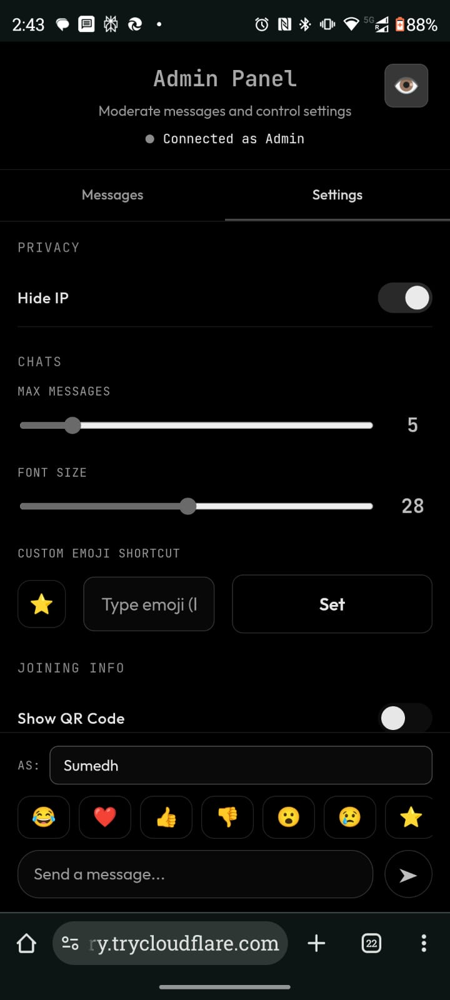
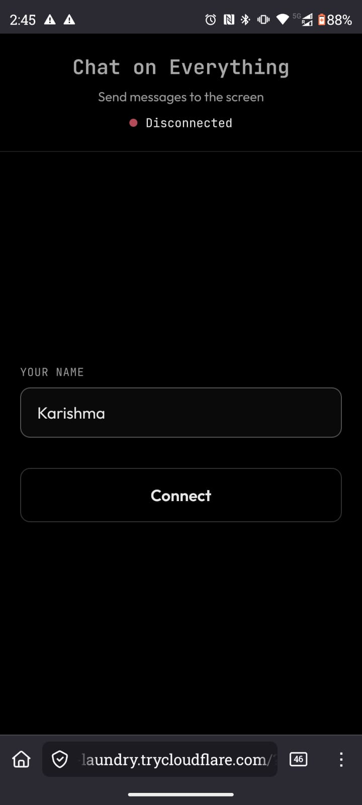
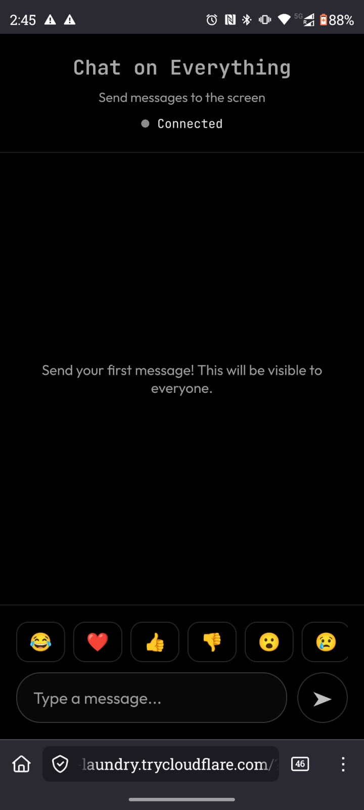

# Chat on Everything

**Chat on Everything** is a transparent overlay for Linux (and other platforms) that provides click-through support, global hotkeys, and a mobile companion app for remote control and chat. It's designed to bring a seamless, HUD-like chat experience to your desktop.

## Features

-   **Transparent Overlay**: A sleek, non-intrusive chat window that sits on top of your other windows.
-   **Click-Through Support**: The overlay allows you to click through it to interact with underlying applications when in "passive" mode.
-   **Global Hotkeys**: Toggle the overlay visibility and input mode instantly with `Ctrl+Alt+K` (customizable).
-   **Mobile Companion App**: Connect your phone via QR code to use it as a secondary screen for chat or a remote control.
-   **Remote Control**: Control your computer's mouse, keyboard, and media playback directly from your mobile device using Nut.js.
-   **@Cee AI Agent**: A built-in context-aware AI assistant (powered by OpenAI or Gemini) that can "see" your screen and answer questions about what you're working on.
-   **Moderation & Privacy**: Includes features like slow mode, IP hiding, and chat history management.

## Tech Stack

-   **Electron**: For the cross-platform desktop application.
-   **Node.js**: The runtime environment.
-   **WebSockets (`ws`)**: For real-time communication between the desktop app and mobile companion.
-   **Nut.js**: For desktop automation and remote control capabilities.
-   **Cloudflare Tunnel**: For secure remote access without port forwarding.
-   **Google GenAI / OpenAI**: Powering the `@Cee` AI agent.

## Gallery

### Desktop Interface


### Mobile Companion




## Installation & Build

### Prerequisites
-   Node.js (v18 or higher recommended)
-   npm (comes with Node.js)

### Running Locally

1.  Clone the repository:
    ```bash
    git clone https://github.com/sumsupee/chatoneverything.git
    cd chatoneverything
    ```

2.  Install dependencies:
    ```bash
    npm install
    ```

3.  Start the application:
    ```bash
    npm start
    ```

    *Note: On Linux, this runs with `ELECTRON_OZONE_PLATFORM_HINT=x11` and transparency flags enabled.*

### Building for Production

Use the following commands to build the application for your specific platform:

-   **Linux**: `npm run build:linux` (Outputs AppImage and deb)
-   **Windows**: `npm run build:win` (Outputs NSIS installer and portable executable)
-   **macOS**: `npm run build:mac` (Outputs DMG and ZIP)

## Troubleshooting

### macOS: "App is damaged and can't be opened"

If you see this error when trying to run the app on macOS, it is because the app is not notarized by Apple.

**How to Fix:**

1.  Move the app to your **Applications** folder.
2.  Open **Terminal** (Cmd+Space, type "Terminal").
3.  Run the following command to remove the quarantine attribute:

    ```bash
    xattr -cr /Applications/chat-on-everything.app
    ```
    *(Note: If you renamed the app, replace `chat-on-everything.app` with the correct name)*

4.  You should now be able to open the app normally.

## Contributing

Contributions are welcome! Please follow these steps:

1.  Fork the repository.
2.  Create a new branch (`git checkout -b feature/your-feature`).
3.  Commit your changes (`git commit -m 'Add some feature'`).
4.  Run linting to ensure code style:
    ```bash
    npm run lint
    ```
5.  Push to the branch (`git push origin feature/your-feature`).
6.  Open a Pull Request.

## License

This project is licensed under the MIT License - see the [LICENSE](LICENSE) file for details.
